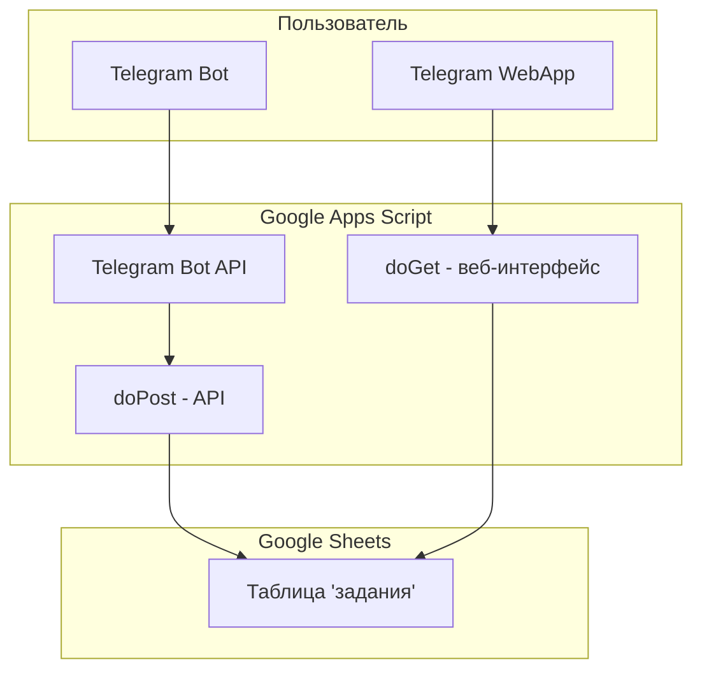

# Документация по проекту Kanban Board

## 1. Общее описание проекта

Проект представляет собой систему управления задачами (Kanban-доску) с интеграцией Telegram. Система состоит из трёх основных компонентов:

- **Google Apps Script (backend)** — серверная часть, размещённая в Google Таблицах
- **Telegram Bot** — бот для управления задачами через команды
- **Telegram WebApp** — веб-интерфейс для работы с задачами

### Назначение системы

Система предназначена для персонального учёта задач с возможностью доступа через Telegram. Пользователь может добавлять задачи, отслеживать их статус и просматривать списки через интерфейс бота или веб-приложения.

---

## 2. Архитектура системы

### Структура данных



### База данных

Используется Google Таблица со следующей структурой:

| Колонка | Описание | Тип данных |
|---------|----------|-------------|
| ID | Уникальный идентификатор задачи | Строка |
| Задание | Текст задачи | Строка |
| Статус | Статус выполнения (todo/in-progress/done) | Строка |
| Дата начала | Дата начала работы над задачей | Дата |
| Дата конца | Дата завершения задачи | Дата |
| Время выполнения | Продолжительность выполнения | Строка |
| Плановая дата | Планируемая дата выполнения | Дата |

---

## 3. Компонент backend (cod.gs)

### Основные константы

```javascript
const SPREADSHEET_ID = '1TsUjce91h44W_PF4dzCqCwGTB_jqhjJxRWBsLiGPmjE';
const SHEET_NAME = 'задания';
const LOCK_TIMEOUT_SECONDS = 30;
const TELEGRAM_BOT_TOKEN = '8664566561:AAEV11uRMZIxmqjcoQybafCWAmQhdoQdbXs';
```

### API-режимы

Скрипт поддерживает несколько режимов работы:

1. **web** — стандартный веб-интерфейс (по умолчанию)
2. **jsonp** — JSONP-режим для обхода CORS (используется с GitHub Pages)
3. **tg-api** — JSON API для внешнего фронтенда
4. **telegram** — HTML-интерфейс для Telegram

### Функции API

#### getTasks()

Возвращает список всех задач из таблицы.

**Возвращаемое значение:** массив объектов задач

```javascript
{
  id: string,
  title: string,
  status: string,      // 'todo' | 'in-progress' | 'done'
  startDate: string,   // формат YYYY-MM-DD
  endDate: string,     // формат YYYY-MM-DD
  duration: string,    // например: '5 дн.'
  plannedDate: string  // формат YYYY-MM-DD
}
```

#### addTask(title, plannedDate)

Добавляет новую задачу.

**Параметры:**

- `title` (string) — текст задачи
- `plannedDate` (string) — плановая дата выполнения

**Возвращаемое значение:** обновлённый массив задач

#### updateTaskStatus(taskId, newStatus)

Обновляет статус задачи.

**Параметры:**

- `taskId` (string) — идентификатор задачи
- `newStatus` (string) — новый статус ('todo', 'in-progress', 'done')

**Особенности:**

- При установке статуса 'done' автоматически вычисляется продолжительность выполнения
- Задачи со статусом 'done' перемещаются наверх списка

#### deleteTask(taskId)

Удаляет задачу по идентификатору.

### Telegram Bot API

#### Поддерживаемые команды

| Команда | Описание |
|---------|----------|
| /start | Запуск бота, показ приветственного сообщения |
| /add <текст> | Добавление новой задачи |
| /list | Показать список всех задач |
| /refresh | Обновить данные |
| /help | Показать справку |

#### Функции для работы с Telegram

- `sendMessage(chatId, text, parseMode)` — отправка сообщения
- `sendMessageWithKeyboard(chatId, text, buttons)` — отправка сообщения с клавиатурой
- `editMessageReplyMarkup(chatId, messageId, replyMarkup)` — редактирование клавиатуры
- `answerCallbackQuery(callbackQueryId, text)` — ответ на callback-запрос
- `showTaskList(chatId)` — показать список задач пользователю

---

## 4. Компонент frontend (teleg_app_git.html)

### Описание интерфейса

Веб-приложение представляет собой Kanban-доску с тремя колонками:

1. **К выполнению** (todo) — новые задачи
2. **В работе** (in-progress) — задачи в процессе выполнения
3. **Готово** (done) — завершённые задачи

### Основные элементы интерфейса

#### Заголовок приложения

- Название: "Задачи"
- Подзаголовок: "Сначала записать, потом разбирать"
- Кнопка переключения темы (светлая/тёмная)
- Кнопка настроек

#### Секция добавления задачи

- Текстовое поле для ввода задачи
- Выбор плановой даты:
  - Кнопка "Сегодня"
  - Кнопка "Завтра"
  - Кнопки "-1 день" и "+1 день"
  - Кнопка выбора даты из календаря
- Кнопка "Добавить"

#### Вкладки (табы)

- "К выполнению" — счётчик задач
- "В работе" — счётчик задач
- "Готово" — счётчик задач

#### Карточка задачи

- Название задачи
- Бейдж плановой даты (цвет зависит от актуальности)
- Мета-информация (дата начала, продолжительность)
- Кнопки действий (в зависимости от статуса)

### Функции настроек

#### Настройки внешнего вида

Для каждой из трёх колонок можно настроить:

- Размер шрифта (от 10 до 24 пикселей)
- Жирное начертание шрифта (вкл/выкл)

#### Темы оформления

- **Светлая тема** — белый фон, тёмный текст
- **Тёмная тема** — тёмный фон, светлый текст

Переключение темы сохраняется в localStorage.

### Технические особенности

#### Интеграция с Telegram

```html
<script src="https://telegram.org/js/telegram-web-app.js"></script>
```

Приложение использует Telegram Web App API для:

- Автоматической адаптации подtheme Telegram
- Haptic feedback (тактильная обратная связь)
- Работы в режиме WebView

#### JSONP-запросы

Для обхода ограничений CORS используется JSONP-формат:

```
?mode=jsonp&action=getTasks&callback=callbackName
```

#### CSS-переменные

```css
:root {
  --bg-primary: #ffffff;
  --bg-secondary: #f9fafb;
  --bg-card: #ffffff;
  --text-primary: #111827;
  --text-secondary: #6b7280;
  --accent-color: #4f46e5;
  --success-color: #22c55e;
}
```

---

## 5. Технологический стек

| Компонент | Технология |
|-----------|------------|
| Backend | Google Apps Script |
| База данных | Google Таблицы |
| Бот | Telegram Bot API |
| Frontend | HTML5, CSS3, Vanilla JavaScript |
| Интеграция | Telegram WebApp SDK |

---

## 6. Зависимости

### Внешние ресурсы

- Telegram WebApp JS: `https://telegram.org/js/telegram-web-app.js`
- Шрифты: системные шрифты (Apple System, Segoe UI, Roboto, Ubuntu)

---

## 7. Возможные сценарии использования

### Сценарий 1: Добавление задачи через WebApp

1. Пользователь открывает WebApp в Telegram
2. Вводит текст задачи в поле
3. При необходимости выбирает плановую дату
4. Нажимает кнопку "Добавить"
5. Задача появляется в соответствующей колонке

### Сценарий 2: Добавление задачи через бота

1. Пользователь отправляет команду `/add Купить молоко`
2. Бот добавляет задачу в таблицу
3. Подтверждает добавление сообщением

### Сценарий 3: Изменение статуса задачи

1. Пользователь нажимает на задачу в WebApp
2. Выбирает действие ("В работу", "Готово", "Назад")
3. Задача перемещается в соответствующую колонку
4. При завершении автоматически вычисляется время выполнения

### Сценарий 4: Просмотр задач через бота

1. Пользователь отправляет команду `/list`
2. Бот отправляет сообщение с разбивкой по статусам

---

## 8. Ограничения и особенности

### Ограничения Google Apps Script

- Ограничение на время выполнения скрипта (обычно до 6 минут)
- Ограничение на количество запросов к внешним API
- Использование LockService для предотвращения конфликтов

### Особенности работы

- При завершении задачи автоматически вычисляется продолжительность выполнения в днях
- Завершённые задачи перемещаются в начало списка
- Задачи сортируются по плановой дате (ближайшие — первыми)
- JSONP-режим используется для обхода CORS при размещении на GitHub Pages

---

## 8. Сортировка задач

### Порядок отображения

Задачи в столбцах **"To Do"** и **"In Progress"** отображаются в следующем порядке:

| № | Группа | Условие | Описание |
|---|--------|---------|----------|
| 1 | **На сегодня** | `plannedDate === today` | Задачи с плановой датой равной текущей дате |
| 2 | **Просроченные** | `plannedDate < today` | Задачи с просроченной плановой датой (от старых к новым) |
| 3 | **На будущее** | `plannedDate > today` | Задачи на завтра и далее (от ближайшей к дальней) |
| 4 | **Без даты** | `!plannedDate` | Задачи без запланированной даты |

### Внутригрупповая сортировка

- **На сегодня**: по плановой дате (возрастание)
- **Просроченные**: по плановой дате (возрастание, старые просроченные первыми)
- **На будущее**: по плановой дате (возрастание, ближайшие первыми)
- **Без даты**: по дате создания (возрастание)

### Ручная сортировка

Пользователь может изменить порядок сортировки внутри каждой группы:
- Кнопка **"📅 По дате"** — переключает режим сортировки
- Режимы: `по возрастанию` → `по убыванию` → `по умолчанию`

При ручной сортировке используется `startDate` (дата создания/начала работы).

---

## 10. Структура файлов проекта

| Файл | Описание | Размер |
|------|----------|--------|
| cod.gs | Google Apps Script (backend) | ~18 КБ |
| teleg_app_git.html | Telegram WebApp (frontend) | ~46 КБ |

---

## 11. Конфигурация

### ID Таблицы

```
1TsUjce91h44W_PF4dzCqCwGTB_jqhjJxRWBsLiGPmjE
```

### Токен Telegram-бота

```
8664566561:AAEV11uRMZIxmqjcoQybafCWAmQhdoQdbXs
```

---

## 11. Версионирование и развёртывание

### Развёртывание Google Apps Script

1. Открыть script.google.com
2. Создать новый проект
3. Вставить код из cod.gs
4. Развернуть как веб-приложение
5. Настроить доступ для "Все пользователи"

### Подключение Telegram-бота

1. Создать бота через @BotFather
2. Получить токен
3. Настроить webhook на URL развёртывания Google Apps Script
4. Обновить константу TELEGRAM_BOT_TOKEN в коде

---

## 12. Логирование и отладка

Система использует Logger для отладки:

- Логирование входящих запросов
- Логирование действий с задачами
- Логирование ошибок API Telegram

Просмотр логов: Google Apps Script > ExpLog > Просмотр журналов

---

*Документация создана автоматически на основе исходного кода проекта*
