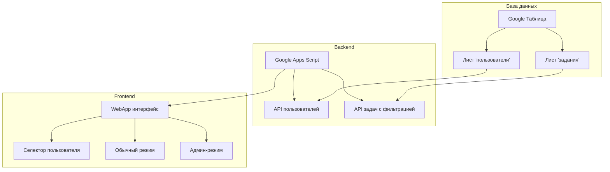
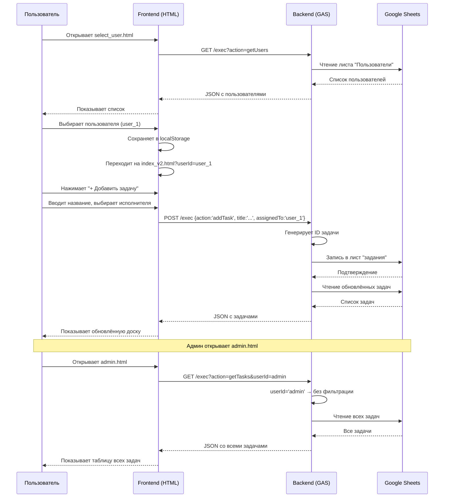

# План модернизации Kanban-доски: Многопользовательский режим

## ✅ Возможность реализации

**Да, это реализуемо.** Текущая архитектура проекта (Google Apps Script + Telegram WebApp) позволяет добавить многопользовательский режим без существенных архитектурных изменений.

---

## 📊 Текущее состояние

Сейчас система:
- Хранит задачи в Google Таблице
- Не имеет понятия "пользователь" или "исполнитель"
- Показывает все задачи всем пользователям

---

## 🎯 Цель модернизации

1. **Назначение задач** — при создании задачи выбирать исполнителя из списка пользователей
2. **Персональные рабочие поля** — каждый пользователь видит только свои задачи
3. **Админ-панель** — отдельный режим для просмотра всех задач с фильтрацией по исполнителю

---

## 🏗️ Архитектура решения



---

## 📋 План реализации

### Этап 1: Расширение структуры данных

**Backend (cod.gs):**
- [ ] Добавить новый лист "пользователи" в Google Таблицу
- [ ] Расширить структуру задач — добавить колонку "Исполнитель"
- [ ] Создать API для работы с пользователями:
  - `getUsers()` — получить список пользователей
  - `addUser(name)` — добавить пользователя
  - `deleteUser(id)` — удалить пользователя
- [ ] Модифицировать `getTasks()` — добавить параметр `userId` для фильтрации
- [ ] Модифицировать `addTask()` — добавить параметр `assignee`

**Структура таблицы "пользователи":**
| Колонка | Описание |
|---------|----------|
| ID | Уникальный ID |
| Имя | Имя пользователя |
| Роль | admin / user |
| Telegram ID | (опционально) |

**Структура таблицы "задания" (расширенная):**
| Колонка | Описание |
|---------|----------|
| ID | Уникальный ID |
| Задание | Текст задачи |
| Статус | todo/in-progress/done |
| Дата начала | Дата начала |
| Дата конца | Дата завершения |
| Время выполнения | Продолжительность |
| Плановая дата | Планируемая дата |
| **Исполнитель** | **ID пользователя (НОВАЯ)** |
| **Автор** | **Кто создал задачу (НОВАЯ)** |

---

### Этап 2: Модификация Frontend

**WebApp (teleg_app_git.html):**

- [ ] Добавить селектор пользователя в header
  - Выпадающий список или кнопка выбора
  - Сохранение выбора в localStorage
  - Возможность переключения пользователя

- [ ] Добавить поле "Выбор исполнителя" при создании задачи
  - Выпадающий список всех пользователей
  - По умолчанию текущий пользователь

- [ ] Модифицировать отображение задач
  - Показывать только задачи выбранного пользователя
  - Показывать имя исполнителя на карточке

- [ ] Создать Админ-режим
  - Кнопка переключения в админ-режим
  - Просмотр всех задач всех пользователей
  - Фильтры:
    - Все задачи
    - Задачи конкретного пользователя
    - Задачи без исполнителя
  - Возможность переназначить задачу

---

### Этап 3: Интеграция с Telegram (опционально)

- [ ] Обновить команды бота для работы с пользователями
  - `/my` — показать мои задачи
  - `/all` — показать все задачи (для админа)
  - `/assign <задача> <пользователь>` — назначить задачу

---

## 🔧 Технические детали реализации

### JSONP API (расширение)

```
?mode=jsonp&action=getTasks&callback=cb&userId=id
?mode=jsonp&action=addTask&callback=cb&title=...&assignee=...
?mode=jsonp&action=getUsers&callback=cb
?mode=jsonp&action=addUser&callback=cb&name=...
```

### Фильтрация задач на сервере

```javascript
function getTasks(userId, includeAll) {
  const allTasks = // ... чтение из таблицы
  
  if (includeAll === 'true') {
    // Админ видит все
    return allTasks;
  }
  
  if (userId) {
    // Фильтр по исполнителю
    return allTasks.filter(task => task.assignee === userId);
  }
  
  // Без фильтра — все задачи (для совместимости)
  return allTasks;
}
```

### Выбор пользователя в интерфейсе

```javascript
// Сохранение
localStorage.setItem('currentUserId', userId);
localStorage.setItem('currentUserName', userName);
localStorage.setItem('isAdmin', isAdmin);

// Загрузка
const currentUserId = localStorage.getItem('currentUserId');
```

---

## ⚠️ Потенциальные сложности

1. **Миграция существующих данных** — нужно будет добавить исполнителя ко всем текущим задачам
2. **Синхронизация с Telegram** — если бот используется, нужно продумать как он определяет пользователя
3. **Права доступа** — решить, может ли обычный пользователь видеть задачи других

---

## 📝 Резюме

| Аспект | Решение |
|--------|---------|
| Хранение пользователей | Новый лист в Google Таблице |
| Назначение задач | Новая колонка "Исполнитель" |
| Персональные задачи | Фильтрация по userId при GET запросах |
| Админ-панель | Переключатель режима + фильтры |
| Обратная совместимость | Сохранение совместимости со старым API |

---

## 🚀 Следующие шаги

1. Подтвердить план
2. Перейти в режим разработки (Code mode)
3. Реализовать этап 1 (Backend)
4. Реализовать этап 2 (Frontend)
5. Тестирование

---

## ✅ Статус реализации

**Все этапы реализованы!** Система готова к использованию.

### Реализованные компоненты:

| Компонент | Файл | Статус |
|-----------|------|--------|
| Backend API | `v2/cod_v2.gs` | ✅ Готово |
| Страница выбора пользователя | `v2/select_user.html` | ✅ Готово |
| Kanban-доска (user mode) | `v2/index_v2.html` | ✅ Готово |
| Админская панель | `v2/admin.html` | ✅ Готово |
| Документация | `v2/README.md`, `v2/SETUP_INSTRUCTIONS.md` | ✅ Готово |
| Инструкция по тестированию | `v2/TESTING.md` | ✅ Готово |

---

## 📦 Что в коробке

### Backend возможности (`cod_v2.gs`):

```javascript
// Пользователи
getUsers()                    // Получить всех пользователей
addUser(name, telegramId, role)         // Добавить пользователя
updateUser(userId, name, telegramId, role)  // Обновить пользователя
deleteUser(userId)            // Удалить пользователя

// Задачи
getTasks(userId)              // Получить задачи (с фильтрацией по userId)
addTask(title, plannedDate, assignedTo)   // Добавить задачу
updateTask(taskId, updates)   // Обновить задачу
updateTaskStatus(taskId, newStatus)       // Изменить статус
deleteTask(taskId)            // Удалить задачу
```

### Frontend страницы:

| Страница | URL параметр | Описание |
|----------|--------------|----------|
| Выбор пользователя | `select_user.html` | Вход в систему, выбор/создание пользователя |
| Kanban доска | `index_v2.html?userId=USER_ID` | Рабочее поле пользователя |
| Админка | `admin.html` | Управление всеми задачами и пользователями |

---

## 🔄 Поток данных

```
┌─────────────────────────────────────────────────────────────────┐
│ 1. Пользователь открывает select_user.html                      │
│    → Загружает список пользователей через API                   │
│    → Выбирает пользователя                                      │
│    → localStorage: currentUserId = 'user_1'                     │
│    → Переходит на index_v2.html?userId=user_1                   │
└─────────────────────────────────────────────────────────────────┘
                              ↓
┌─────────────────────────────────────────────────────────────────┐
│ 2. index_v2.html загружается с userId из URL                    │
│    → GET /exec?mode=jsonp&action=getTasks&userId=user_1         │
│    → Backend фильтрует задачи только для user_1                 │
│    → Отображает персональную Kanban-доску                       │
└─────────────────────────────────────────────────────────────────┘
                              ↓
┌─────────────────────────────────────────────────────────────────┐
│ 3. Создание новой задачи                                        │
│    → Пользователь нажимает "+ Добавить задачу"                  │
│    → Выбирает исполнителя из dropdown (список пользователей)    │
│    → POST /exec {action: 'addTask', title: '...', assignedTo: 'user_2'}
│    → Backend сохраняет задачу с assignedTo='user_2'             │
│    → Задача появляется у user_2                                 │
└─────────────────────────────────────────────────────────────────┘
                              ↓
┌─────────────────────────────────────────────────────────────────┐
│ 4. Админ открывает admin.html                                   │
│    → GET /exec?mode=jsonp&action=getTasks&userId=admin          │
│    → Backend возвращает ВСЕ задачи (без фильтрации)             │
│    → Отображает таблицу со всеми задачами                       │
│    → Фильтры: по пользователю, статусу, поиску                  │
│    → CRUD: создание, редактирование, удаление задач/пользователей
└─────────────────────────────────────────────────────────────────┘
```

---

## 🗂️ Структура данных в Google Таблице

### Лист "задания":

| A | B | C | D | E | F | G | H |
|---|---|---|---|---|---|---|---|
| **ID** | **Задание** | **Статус** | **Дата начала** | **Дата конца** | **Время выполнения** | **Плановая дата** | **AssignedTo** |
| task_1709654321_abc123 | Купить молоко | todo | 2026-03-05 | | | 2026-03-06 | user_1 |
| task_1709654322_def456 | Сделать отчёт | in-progress | 2026-03-04 | | | 2026-03-07 | user_2 |
| task_1709654323_ghi789 | Позвонить клиенту | done | 2026-03-03 | 2026-03-04 | 1 дн. | 2026-03-04 | user_1 |

### Лист "Пользователи":

| A | B | C | D |
|---|---|---|---|
| **UserID** | **Имя** | **TelegramID** | **Роль** |
| user_1709654300_xxx | Артём | @artem | user |
| user_1709654301_yyy | Игорь | @igor | user |
| user_1709654302_zzz | Админ | @admin | admin |

---

## 🔐 Матрица прав доступа

| Действие | user | admin |
|----------|------|-------|
| Видеть свои задачи | ✅ | ✅ |
| Видеть все задачи | ❌ | ✅ |
| Создать задачу | ✅ | ✅ |
| Назначить задачу на себя | ✅ | ✅ |
| Назначить задачу на другого | ❌ | ✅ |
| Редактировать свои задачи | ✅ | ✅ |
| Редактировать чужие задачи | ❌ | ✅ |
| Удалять свои задачи | ❌ | ✅ |
| Удалять чужие задачи | ❌ | ✅ |
| Управлять пользователями | ❌ | ✅ |

---

## 📊 Диаграмма последовательности



---

## 🧪 Сценарии тестирования

### Сценарий 1: Обычный пользователь

1. Артём открывает `select_user.html`
2. Выбирает себя из списка
3. Попадает на персональную доску
4. Создаёт задачу "Купить молоко" → назначает на себя
5. Видит задачу в колонке "📝 Задания"
6. Перемещает в "🔄 В работе"
7. Завершает задачу → "✅ Готово"

### Сценарий 2: Назначение задачи другому

1. Артём (админ) открывает `index_v2.html`
2. Создаёт задачу "Подготовить отчёт"
3. Назначает на Игоря
4. Игорь заходит на свою доску
5. Видит новую задачу в своём списке

### Сценарий 3: Админская панель

1. Админ открывает `admin.html`
2. Видит все задачи всех пользователей
3. Фильтрует по "Игорь" → только задачи Игоря
4. Фильтрует по "done" → только готовые
5. Создаёт задачу, назначает на Артёма
6. Редактирует задачу Игоря (меняет статус)
7. Удаляет старую задачу

### Сценарий 4: Управление пользователями

1. Админ открывает `admin.html`
2. В секции "Пользователи" нажимает "➕ Добавить"
3. Создаёт нового пользователя "Мария"
4. Редактирует "Игорь" → меняет имя на "Игорь К."
5. Удаляет уволенного сотрудника

---

## 🎯 Критерии приёмки

- [x] Пользователи хранятся в Google Таблице
- [x] Задачи имеют поле `AssignedTo`
- [x] API фильтрует задачи по `userId`
- [x] Страница выбора пользователя работает
- [x] Каждый пользователь видит только свои задачи
- [x] Админ видит все задачи
- [x] Админ может назначать задачи на любого
- [x] CRUD задач работает (создание, чтение, обновление, удаление)
- [x] CRUD пользователей работает
- [x] Фильтры в админке работают
- [x] Drag-and-drop между колонками работает
- [x] Сохранена обратная совместимость со старым API

---

## 📝 Заметки

- **Обратная совместимость**: Старый frontend (`index.html`) продолжит работать, но будет показывать все задачи всем
- **Миграция**: Старые задачи без `AssignedTo` можно показать всем или назначить на админа
- **Telegram**: Бот продолжает работать, но задачи добавляются без исполнителя (нужно доработать)

---

**Реализация завершена!** Система готова к развёртыванию и использованию. 🎉
